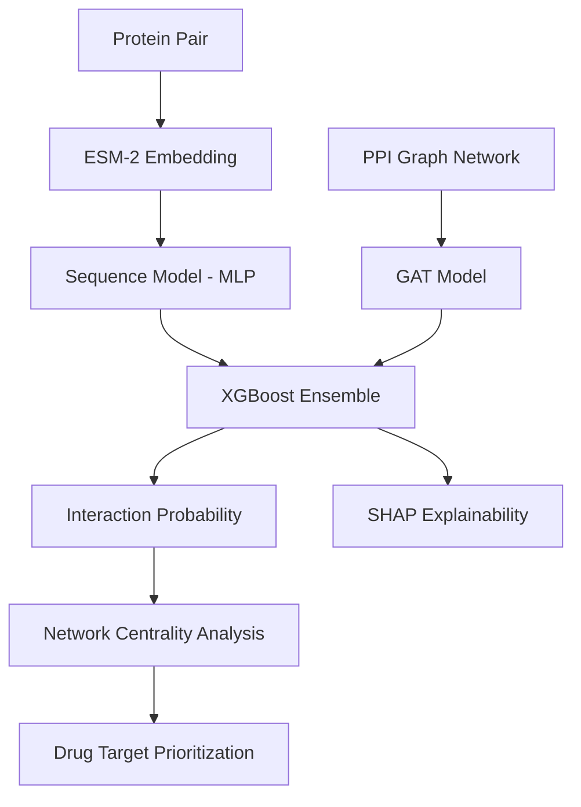

# TransGraph-PPI  
### Hybrid Deep Learning Framework for Protein–Protein Interaction Prediction


A hybrid machine learning framework for **Protein–Protein Interaction (PPI) prediction** combining **Protein Language Models (ESM-2)** and **Graph Neural Networks (GAT)** with explainability and drug target prioritization.

---

# Overview

Protein–Protein Interactions play a crucial role in understanding biological systems, disease mechanisms, and drug discovery.

**TransGraph-PPI** integrates:

- Sequence Representation Learning
- Graph Structural Learning
- Ensemble Modeling
- Explainable AI

to build a robust prediction system.

The framework combines:

| Component | Role |
|-----------|------|
| ESM-2 | Extract protein sequence embeddings |
| MLP Sequence Model | Sequence-based interaction prediction |
| Graph Attention Network (GAT) | Learn interaction patterns in PPI networks |
| XGBoost Ensemble | Combine predictions from both models |
| SHAP | Explain model decisions |

---

# System Architecture



---

# Model Performance

| Model | Accuracy | Precision | Recall | F1 Score |
|------|----------|-----------|--------|----------|
| Sequence Model (ESM-2 + MLP) | 0.856 | 0.85 | 0.86 | 0.85 |
| Graph Model (GAT) | 0.842 | 0.84 | 0.84 | 0.84 |
| Ensemble Model | **0.879** | **0.88** | **0.87** | **0.88** |

The ensemble model improves prediction performance by integrating **sequence semantics** and **interaction network topology**.

---

# Dataset

The dataset contains **protein pairs and interaction labels** used to train the model.

| Property | Value |
|----------|------|
| Total Samples | 363,081 |
| Training Samples | 322,739 |
| Validation Samples | 40,342 |
| Class Balance | Balanced |

Data sources include:

- STRING Database
- UniProt
- ChEMBL

---

# Installation

## Clone Repository

```bash
git clone https://github.com/yourusername/TransGraph-PPI.git
cd TransGraph-PPI
```

## Create Virtual Environment

### Windows

```bash
python -m venv venv
venv\Scripts\activate
```

### Linux / Mac

```bash
python -m venv venv
source venv/bin/activate
```

---

## Install Dependencies

```bash
pip install -r requirements.txt
```

---

## Install Frontend Dependencies

```bash
cd app/frontend
npm install
cd ../..
```

---

# Data Pipeline

Run the pipeline in sequence.

## Data Collection

```bash
python src/data/collect_ppi.py
```

Fetches:

- Protein interaction data
- Protein sequences
- Drug target information

---

## Data Preprocessing

```bash
python src/data/preprocess_data.py
```

---

## Feature Extraction

```bash
python src/data/feature_extraction.py
```

Generates **ESM-2 embeddings**.

---

## Graph Construction

```bash
python src/data/graph_construction.py
```

Builds the **protein interaction graph**.

---

# Model Training

## Train Sequence Model

```bash
python src/training/train_sequence_model.py --embedding_path data/processed/embeddings.pt
```

---

## Train Graph Model

```bash
python src/training/train_graph_model.py --graph_path data/processed/ppi_graph.pt
```

---

## Train Ensemble Model

```bash
python src/training/train_ensemble.py
```

---

# Running the Web Application

## Start Backend

```bash
cd app/backend
uvicorn main:app --reload
```

Backend runs on:

```
http://localhost:8000
```

---

## Start Frontend

```bash
cd app/frontend
npm run dev
```

Frontend runs on:

```
http://localhost:5173
```

---

# Project Structure

```
TransGraph-PPI
│
├── src
│   ├── data
│   │   ├── collect_ppi.py
│   │   ├── preprocess_data.py
│   │   ├── feature_extraction.py
│   │   └── graph_construction.py
│   │
│   ├── models
│   │   ├── sequence_model.py
│   │   └── gat_model.py
│   │
│   ├── training
│   │   ├── train_sequence_model.py
│   │   ├── train_graph_model.py
│   │   └── train_ensemble.py
│   │
│   └── evaluation
│
├── app
│   ├── backend
│   └── frontend
│
├── data
│   ├── raw
│   └── processed
│
├── models
│   └── trained model checkpoints
│
├── notebooks
│   └── research experiments
│
└── README.md
```

---

# Future Work

- GAT attention visualization
- Integration with STRING API
- Graph Transformer Networks
- Cloud deployment with Docker

---

# Citation

If you use this repository in research:

```
@project{transgraph_ppi,
  title={TransGraph-PPI: Hybrid Ensemble Framework for Protein Interaction Prediction},
  author={Ashwini Shenoy B,Basil S},
  year={2026}
}
```

---

# Contributors

**Ashwini Shenoy B**  
**Basil S**


Major Project — Deep Learning for Bioinformatics

