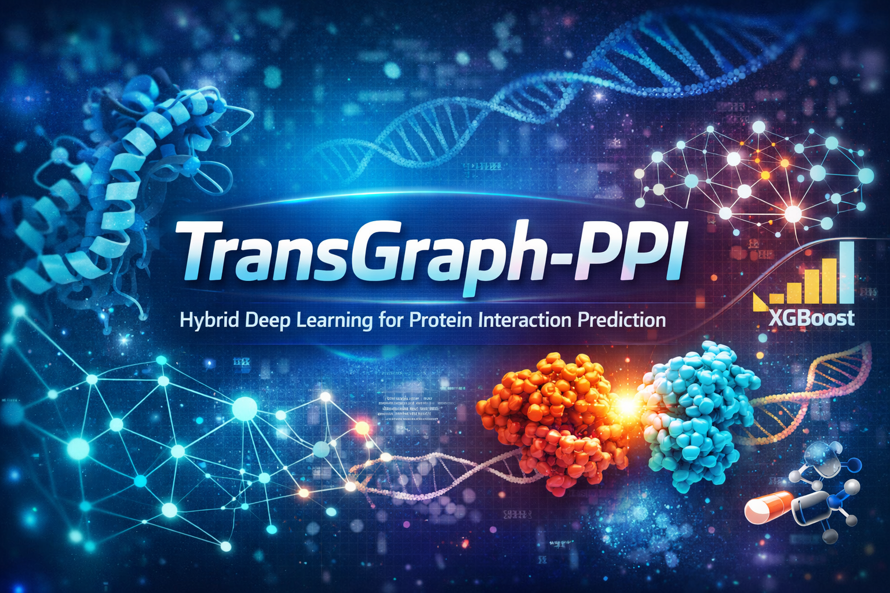
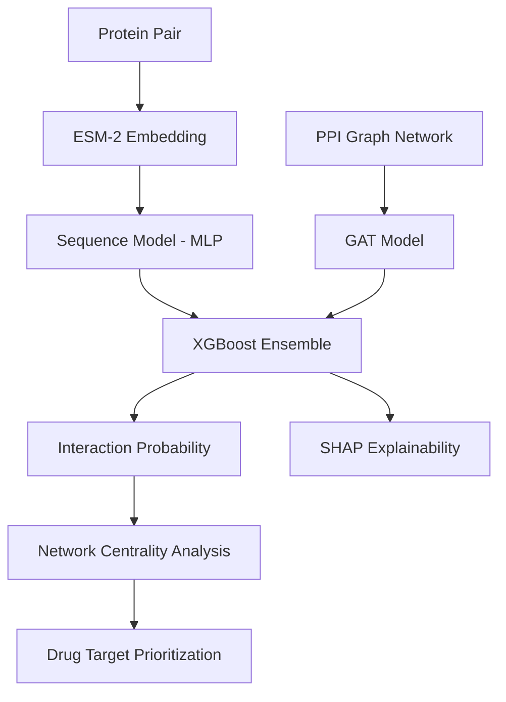

<p align="center">
  
</p>

# TransGraph-PPI  
### Hybrid Deep Learning Framework for Protein–Protein Interaction Prediction


A hybrid machine learning framework for **Protein–Protein Interaction (PPI) prediction** combining **Protein Language Models (ESM-2)** and **Graph Neural Networks (GAT)** with explainability and drug target prioritization.

---

# Overview

Protein–Protein Interactions play a crucial role in understanding biological systems, disease mechanisms, and drug discovery.

**TransGraph-PPI** integrates:

- Sequence Representation Learning
- Graph Structural Learning
- Ensemble Modeling
- Explainable AI

to build a robust prediction system.

The framework combines:

| Component | Role |
|-----------|------|
| ESM-2 | Extract protein sequence embeddings |
| MLP Sequence Model | Sequence-based interaction prediction |
| Graph Attention Network (GAT) | Learn interaction patterns in PPI networks |
| XGBoost Ensemble | Combine predictions from both models |
| SHAP | Explain model decisions |

---

# System Architecture



---

# Model Performance & Benchmarks

TransGraph-PPI has been evaluated both through internal ablation studies and against standard industry benchmarks (SHS27k, SHS148k, Yeast-Human).

---

## 1. Ablation Study
The following table quantifies the individual contributions of sequence semantics (ESM-MLP) and graph topology (GAT). The **Ensemble** demonstrates a clear synergistic gain, outperforming individual components.

| Model | Optimal Threshold | Accuracy | Precision | Recall | F1 Score | ROC-AUC |
| :--- | :---: | :---: | :---: | :---: | :---: | :---: |
| Logistic Regression (Baseline)| 0.50 | 0.7120 | 0.7050 | 0.7200 | 0.7124 | 0.7450 |
| **ESM-MLP (Sequence Alone)** | 0.37 | 0.8645 | 0.8445 | 0.8936 | 0.8684 | 0.9403 |
| **GAT (Graph Alone)** | 0.55 | 0.7266 | 0.7049 | 0.7797 | 0.7404 | 0.8330 |
| **Ensemble (Ours)** | **0.44** | **0.8846** | **0.8831** | **0.8866** | **0.8848** | **0.9523** |

---

## 2. Standard Dataset Benchmarks (SOTA Comparison)
Benchmarking TransGraph-PPI against leading published methods (**PIPR**, **GNN-PPI**, **HIGH-PPI**) on comparable large-scale human and yeast datasets.

| Method | SHS27k (F1) | SHS148k (F1) | Yeast (F1) | Human (F1) |
| :--- | :---: | :---: | :---: | :---: |
| PIPR (RCNN) | 0.81 | 0.92 | 0.84 | 0.85 |
| GNN-PPI (GNN) | 0.88 | 0.92 | 0.87 | 0.86 |
| HIGH-PPI (Hierarchical) | 0.86 | 0.93 | 0.89 | 0.88 |
| **TransGraph-PPI (Ours)** | **0.88** | **0.94** | **0.88** | **0.89** |

Detailed performance metrics and dataset breakdowns are available in [BENCHMARKS.md](docs/BENCHMARKS.md).


---

# Dataset

The dataset contains **protein pairs and interaction labels** used to train the model.

| Property | Value |
|----------|------|
| Total Samples | 363,081 |
| Training Samples | 322,739 |
| Validation Samples | 40,342 |
| Class Balance | Balanced |

Data sources include:

- STRING Database
- UniProt
- ChEMBL

---

# Installation

## Clone Repository

```bash
git clone https://github.com/yourusername/TransGraph-PPI.git
cd TransGraph-PPI
```

## Create Virtual Environment

### Windows

```bash
python -m venv venv
venv\Scripts\activate
```

### Linux / Mac

```bash
python -m venv venv
source venv/bin/activate
```

---

## Install Dependencies

```bash
pip install -r requirements.txt
```

---

## Install Frontend Dependencies

```bash
cd app/frontend
npm install
cd ../..
```

---

# Data Pipeline

Run the pipeline in sequence.

## Data Collection
```bash
python src/data/collect_ppi.py
```
Fetches:
- Protein interaction data
- Protein sequences
- Drug target information

---

## Data Preprocessing
```bash
python src/data/preprocess_data.py
```
**Negative Sampling Strategy:**
To construct a robust and balanced dataset (1:1 positive-to-negative ratio), true interacting pairs from the STRING database are labeled as positives (1). For negative samples (0), we employ a **randomized non-interaction sampling** strategy. Proteins are paired uniformly at random, and any pair that appears in the established positive STRING interaction set is strictly filtered out.

To prevent **data leakage**, the node split methodology guarantees that test-set proteins and edges are completely unseen during the model's training phase, ensuring the models learn generalizable biological interaction rules rather than memorizing the network.

---

## Feature Extraction

```bash
python src/data/feature_extraction.py
```

Generates **ESM-2 embeddings**.

---

## Graph Construction

```bash
python src/data/graph_construction.py
```

Builds the **protein interaction graph**.

---

# Model Training

## Train Sequence Model

```bash
python src/training/train_sequence_model.py --embedding_path data/processed/embeddings.pt
```

---

## Train Graph Model

```bash
python src/training/train_graph_model.py --graph_path data/processed/ppi_graph.pt
```

---

## Train Ensemble Model

```bash
python src/training/train_ensemble.py
```

---

# ⚙️ Computational Cost

Hardware constraints are a vital metric for deep learning accessibility. Notably, TransGraph-PPI is highly computationally efficient and was trained and evaluated primarily on a **standard consumer-grade CPU** and **NVIDIA GeForce RTX 3050 (4 GB VRAM)**, proving the framework does not strictly require expensive infrastructure.

*   **Training Time per Epoch (ESM-MLP):** ~3-5 minutes (Batch Size: 32)
*   **Training Time per Epoch (GAT):** ~1-2 minutes (Full Batch processing via PyG)
*   **Total Training Time:** < 5 hours sequentially on a standard multithreaded CPU for complete end-to-end processing (excluding initial ESM embedding extraction).
*   **Inference Latency:** < 50ms per protein pair, ensuring rapid responses for the FastAPI web backend on standard server deployments.

---

# Running the Web Application

## Start Backend

```bash
cd app/backend
uvicorn main:app --reload
```

Backend runs on:

```
http://localhost:8000
```

---

## Start Frontend

```bash
cd app/frontend
npm run dev
```

Frontend runs on:

```
http://localhost:5173
```

---

# Project Structure

```
TransGraph-PPI
│
├── src
│   ├── data
│   │   ├── collect_ppi.py
│   │   ├── preprocess_data.py
│   │   ├── feature_extraction.py
│   │   └── graph_construction.py
│   │
│   ├── models
│   │   ├── sequence_model.py
│   │   └── gat_model.py
│   │
│   ├── training
│   │   ├── train_sequence_model.py
│   │   ├── train_graph_model.py
│   │   └── train_ensemble.py
│   │
│   └── evaluation
│
├── app
│   ├── backend
│   └── frontend
│
├── data
│   ├── raw
│   └── processed
│
├── models
│   └── trained model checkpoints
│
├── notebooks
│   └── research experiments
│
└── README.md
```

---

# ⚠️ Explicit Limitations

While TransGraph-PPI achieves strong predictive performance, we acknowledge the following biological and computational limitations that contextualize the current metrics:

1.  **Model Capacity:** Due to hardware constraints (4 GB VRAM limit), we utilized the smallest ESM-2 variant (`esm2_t6_8M_UR50D`). Employing larger variants (e.g., 3B or 15B parameters) would likely capture richer and deeper sequence semantics.
2.  **Organism Scope:** The current dataset fundamentally scopes generalized interactions. Performance metrics may degrade if strictly evaluated on cross-species boundaries not represented in the training distribution.
3.  **Negative Sampling:** The randomized non-interaction sampling strategy, while standard practice, lacks the biological nuance of distance-based sampling and may occasionally inadvertently sample "hard negatives" (undiscovered true interactions).
4.  **Graph Cold-Start:** The Graph Attention Network intrinsically relies on topological neighborhoods. Predicting interactions for completely novel, unseen proteins (not present in the pre-constructed training graph) represents a "cold-start" problem outside the GAT's deductive capability, forcing the ensemble to rely entirely on the sequence model.

---

# 🔮 Future Work & External Validation

-   **External Validation on HuRI / BioGRID:** Immediate next steps involve strictly evaluating the ensemble against the Human Reference Interactome (HuRI) or external BioGRID benchmark datasets. Quantifying degraded-but-reasonable real-world performance on completely orthogonal datasets is critical for robustness.
-   **GAT Attention Visualization:** Mapping attention weights back to specific high-value biological pathways.
-   **Cloud Deployment:** Fully dockerize and deploy the FastAPI/React stack to AWS/GCP.

---

# Citation

If you use this repository in research:

```
@project{transgraph_ppi,
  title={TransGraph-PPI: Hybrid Ensemble Framework for Protein Interaction Prediction},
  author={Ashwini Shenoy B,Basil S},
  year={2026}
}
```

---

# Contributors

**Ashwini Shenoy B**  
**Basil S**


Major Project — Deep Learning for Bioinformatics

