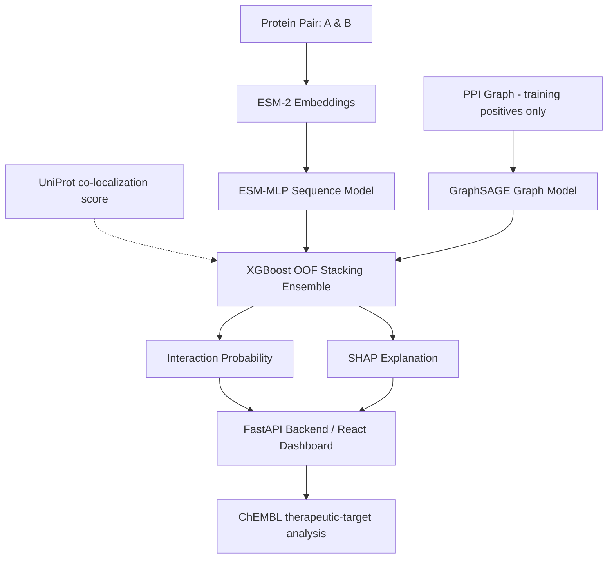

<p align="center">
  
</p>

# TransGraph-PPI
### Hybrid Deep Learning Framework for Protein–Protein Interaction Prediction


**TransGraph-PPI** is a research-oriented multimodal machine learning framework designed for **Protein–Protein Interaction (PPI) prediction**. It integrates deep protein sequence embeddings (ESM-2), graph topological representations (GraphSAGE), an Out-Of-Fold XGBoost stacking meta-ensemble, SHAP explainability, and ChEMBL-based downstream therapeutic-target analysis.

---

## 📌 Overview

Protein–Protein Interactions govern fundamental cellular processes. TransGraph-PPI brings together sequence semantics, biological network topology, domain co-localization context, and explainable AI into a unified web application and prediction pipeline.

### Core Modules

| Component | Architecture / Method | Role |
| :--- | :--- | :--- |
| **Sequence Model** | ESM-2 (`esm2_t12_35M_UR50D`, 35M parameters, 480 dims) + MLP | Deep protein sequence feature extraction & binary interaction scoring |
| **Graph Model** | GraphSAGE (`SAGEConv`) over the training PPI graph | Neighborhood aggregation for link prediction. It has no attention mechanism; the original proposal specified a GAT, but the implemented and evaluated model is GraphSAGE |
| **Biological Context** | UniProt subcellular localization (cache-only score) | One of the 8 ensemble input features; the trained XGBoost model never splits on it, so it has no measurable effect on the reported metrics |
| **Ensemble Meta-Learner** | XGBoost (OOF Stacking) | Stacks the two base-model probabilities plus derived confidence/disagreement features (8 features in total) |
| **Explainability (XAI)** | SHAP (SHapley Additive exPlanations) | Feature attribution on the ensemble's 8 input features |
| **Downstream Analysis** | Degree / betweenness / PageRank centrality + ChEMBL target lookup | Therapeutic-target prioritization (a heuristic score, not a validated ranking) |

---

## 📐 System Architecture



---

## 📊 Final Test Performance

Metrics come from a single evaluation of the held-out **test set (20,172 pairs)**, produced by `python src/analysis/compare_models.py`
and stored in `assets/evaluation/final_test_metrics.json` (also served by `GET /evaluation/final` and shown on the Benchmark page).
Decision thresholds were selected on the validation set (F1-maximizing sweep over 0.10-0.89); the test set was not used for any selection.
All 20,172 test rows were evaluated (none filtered).

| Model | Val-selected threshold | Accuracy | Precision | Recall | F1 | ROC-AUC | PR-AUC |
| :--- | :---: | :---: | :---: | :---: | :---: | :---: | :---: |
| **Random Forest baseline** | 0.48 | 0.8423 | 0.8300 | 0.8608 | 0.8451 | 0.9209 | 0.9245 |
| **ESM-MLP (sequence only)** | 0.47 | 0.8708 | 0.8541 | 0.8944 | 0.8738 | 0.9442 | 0.9467 |
| **GraphSAGE (graph only)** | 0.79 | 0.9010 | 0.9082 | 0.8921 | 0.9001 | 0.9474 | 0.9617 |
| **XGBoost Ensemble (OOF stacking)** | 0.51 | **0.9175** | **0.9381** | 0.8940 | **0.9155** | **0.9626** | **0.9696** |

Notes:
- 5-fold pair-level stratified OOF predictions are used to train the XGBoost meta-learner (`src/training/train_ensemble.py`).
- The ensemble achieves the highest accuracy, precision, F1, ROC-AUC and PR-AUC among the evaluated configurations on this test split; ESM-MLP has marginally higher recall (0.8944 vs 0.8940). No controlled ablation was run, so no causal claim is made about why the ensemble is higher.
- These are single-run results on one split (`random_state=42`); no confidence intervals or significance tests are reported.
- The evaluation is **transductive pair prediction** (see below). It does not establish performance on unseen proteins, and no comparison with published methods is made.

---

## 📁 Dataset & Evaluation Protocol

| Property | Full Dataset | Train | Validation | Test |
| :--- | :---: | :---: | :---: | :---: |
| **Protein pairs** | 201,712 | 161,369 | 20,171 | 20,172 |
| **Positive / negative** | 100,856 / 100,856 | 80,685 / 80,684 | 10,085 / 10,086 | 10,086 / 10,086 |
| **Class balance** | 1:1 | 1:1 | 1:1 | 1:1 |

- **Unique human proteins**: 12,323.
- **Split**: stratified 80/10/10 at the *pair* level (`random_state=42`, `src/data/preprocess_data.py`). The splits are **pair-disjoint but not node-disjoint**: every protein in the test set also occurs in the training set. Pair overlap between splits is zero (`scripts/verify_splits.py`).
- **Graph**: built from the 80,685 positive training pairs only; no validation or test positive appears among its edges. Node features are the 480-d ESM-2 embedding plus degree centrality, clustering coefficient and PageRank.
- **Positives**: STRING v12 human interactions filtered by `combined_score` (script default `--min_score 900`).
- **Negatives**: a mix of random pairs (subject to a UniProt co-localization constraint) and common-neighbor "hard" negatives (`--hard_ratio`, default 0.5), never known STRING positives.
- **Thresholds**: chosen on the validation set only.

---

## ⚙️ Model Notes

- Sequence embeddings use ESM-2 `esm2_t12_35M_UR50D` (35M parameters, 480 dimensions); larger ESM-2 variants are untested.
- `config.yaml` holds device and training defaults. No latency or hardware benchmarks are reported here.

---

## 🚀 Getting Started

### 1. Environment Setup

```bash
# Clone the repository
git clone https://github.com/yourusername/TransGraph-PPI.git
cd TransGraph-PPI

# Create and activate Python environment
python -m venv venv
# On Windows:
venv\Scripts\activate
# On Linux/macOS:
# source venv/bin/activate

# Install requirements
pip install -r requirements.txt
```

### 2. Frontend Setup

```bash
cd app/frontend
npm install
cd ../..
```

---

## 💻 Running the Application

### Start FastAPI Backend
```bash
cd app/backend
uvicorn main:app --reload --port 8000
```
*API docs available at `http://localhost:8000/docs`.*

### Start React Web Interface
```bash
cd app/frontend
npm run dev
```
*Web dashboard available at `http://localhost:5173`.*

---

## 🛠️ Data & Training Pipelines

```bash
# Data Collection & Preprocessing
python src/data/collect_ppi.py
python src/data/preprocess_data.py

# Feature Extraction (ESM-2 Embeddings)
python src/data/feature_extraction.py

# Model Training
python src/training/train_sequence_model.py
python src/training/train_graph_model.py
python src/training/train_ensemble.py
```

### Running Test Suite
```bash
pytest tests/
```
*(13 tests collected; 13 passing at the time of the final cleanup)*

---

## 📂 Project Structure

```
TransGraph-PPI
├── app
│   ├── backend               # FastAPI REST API (inference, SHAP, network endpoints)
│   └── frontend              # React + Vite web dashboard
├── data
│   ├── processed             # Dataset CSVs, embeddings, graph representations
│   └── raw                   # Raw database downloads
├── docs                      # Validation records & diagnostic reports
├── models                    # Trained PyTorch & XGBoost model checkpoints
├── src
│   ├── data                  # Collection, preprocessing, ESM-2 extraction scripts
│   ├── models                # MLP and GraphSAGE neural network definitions
│   ├── training              # Sequence, graph (GraphSAGE), and ensemble training scripts
│   └── evaluation            # Metric calculation and validation scripts
├── tests                     # Unit & end-to-end integration safety tests
└── README.md
```

---

## ⚠️ Explicit Limitations

1. **Transductive evaluation**: the split is pair-disjoint, not node-disjoint, so the reported metrics do not measure generalization to unseen proteins or other species. The cold-start path (nearest-neighbour node insertion in `/predict`) and the Cross-Species page are exploratory and have not been evaluated.
2. **Single split, single run**: results come from one seed/split with no confidence intervals or significance testing.
3. **Biological feature**: the co-localization score is part of the ensemble input, but the trained XGBoost trees never split on it (it is 0.5 for almost every pair, since the UniProt cache covers few proteins), so it contributes nothing measurable.
4. **Synthetic negatives**: negatives are sampled, not experimentally validated, and may include unannotated true interactions.
5. **No external benchmark**: no evaluation on other datasets (e.g. SHS27k, SHS148k, HuRI, BioGRID) has been run, so no comparison with published methods is made.
6. **Embedding scale**: only the 35M-parameter ESM-2 model was used.
7. **Therapeutic targets**: the TTPS score (0.40 degree + 0.35 betweenness + 0.25 ChEMBL indicator) is a heuristic with user-chosen weights, not a validated ranking.

---

## 🔮 Future Research Directions

- **Node-disjoint / cold-start evaluation**: protein-disjoint splits and external datasets (such as HuRI or BioGRID) to measure generalization to unseen proteins.
- **Model scaling**: higher-capacity ESM-2 variants for the sequence model.

---

## 📜 Citation

If you reference or build upon this research framework in your work:

```bibtex
@misc{transgraph_ppi_2026,
  title={TransGraph-PPI: Research Framework for Multimodal Protein-Protein Interaction Prediction},
  author={Ashwini Shenoy B and Basil S},
  year={2026},
  publisher={GitHub},
  journal={GitHub Repository},
  howpublished={\url{https://github.com/yourusername/TransGraph-PPI}}
}
```

---

## 👥 Authors & Acknowledgments

- **Ashwini Shenoy B**
- **Basil S**

*Major Project — Deep Learning for Bioinformatics*
