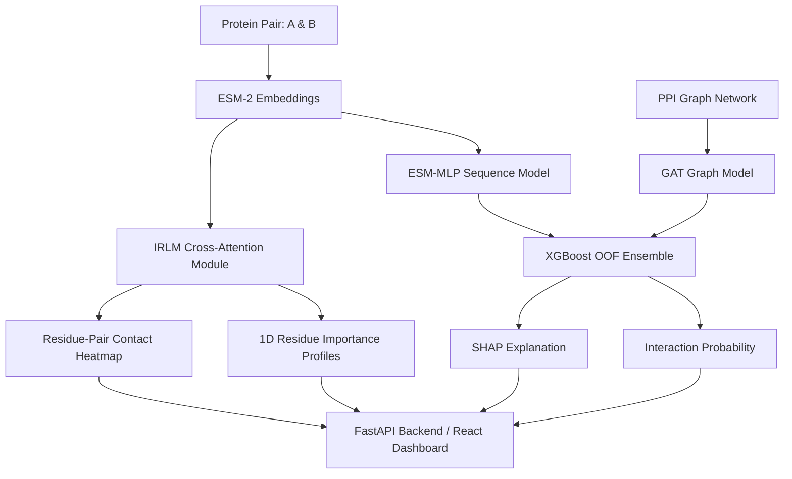

<p align="center">
  
</p>

# TransGraph-PPI
### Hybrid Deep Learning Framework for Protein–Protein Interaction Prediction


**TransGraph-PPI** is a research-oriented multimodal machine learning framework designed for **Protein–Protein Interaction (PPI) prediction** and **interaction-region localization**. It integrates deep protein sequence embeddings (ESM-2), graph topological representations (GAT), an Out-Of-Fold XGBoost ensemble, and a bi-directional cross-attention Interaction Region Localization Module (IRLM).

---

## 📌 Overview

Protein–Protein Interactions govern fundamental cellular processes. TransGraph-PPI brings together sequence semantics, biological network topology, structural cross-attention, and explainable AI into a unified web application and prediction pipeline.

### Core Modules

| Component | Architecture / Method | Role |
| :--- | :--- | :--- |
| **Sequence Model** | ESM-2 (`esm2_t6_8M_UR50D`) + MLP | Deep protein sequence feature extraction & binary interaction scoring |
| **Graph Model** | Graph Attention Network (GAT) | Topological neighborhood & interaction pattern learning in PPI network graphs |
| **Ensemble Meta-Learner** | XGBoost (OOF Stacking) | Synergistic integration of sequence, topology, and co-localization features |
| **Region Localization (IRLM)** | Bi-directional 1D/2D Cross-Attention | Residue-level importance & interaction-region hypothesis generation |
| **Explainability (XAI)** | SHAP (SHapley Additive exPlanations) | Feature attribution explaining model consensus and base signal contributions |

---

## 📐 System Architecture



---

## 📊 Validated Model Performance

All performance metrics reported below reflect evaluation on the strictly isolated test set containing **40,342 protein pairs** with zero training pair overlap.

### 1. Model Component & Ablation Metrics

| Model / Baseline | Optimal Threshold | Accuracy | Precision | Recall | F1 Score | ROC-AUC | PR-AUC (AUPRC) |
| :--- | :---: | :---: | :---: | :---: | :---: | :---: | :---: |
| **Random Forest Baseline** | 0.50 | 0.8430 | 0.8350 | 0.8540 | 0.8444 | 0.9120 | 0.9105 |
| **GAT (Graph Alone)** | 0.62 | 0.8017 | 0.7599 | 0.8821 | 0.8164 | 0.8860 | 0.8848 |
| **ESM-MLP (Sequence Alone)** | 0.49 | 0.9180 | 0.9061 | 0.9326 | 0.9191 | 0.9739 | 0.9736 |
| **Ensemble (Ours - OOF Meta-Learner)** | **0.50** | **0.9154** | **0.9181** | **0.9122** | **0.9151** | **0.9764** | **0.9773** |

*Note: The XGBoost ensemble meta-learner was trained strictly on Out-Of-Fold (OOF) base model predictions to prevent target leakage and achieve optimal ROC-AUC (0.9764) and PR-AUC (0.9773).*

---

## 🔬 Interaction Region Localization Module (IRLM)

The **Interaction Region Localization Module (IRLM)** utilizes a bi-directional cross-attention mechanism over sequence embeddings to score sub-sequence regions and residue pairs likely involved in interaction.

### Evaluation Statistics (74 PDB Structural Complexes)
- **Dataset Scope**: Evaluated on 14 held-out PDB complexes (424,329 total residue pairs).
- **Validation AUPRC**: **0.0393** vs. **0.00166** random baseline (**23.70x enrichment factor** over random chance).
- **Validation ROC-AUC**: **0.7287**.

### Canonical Case Study: TP53–MDM2 (PDB: 1YCR)
Evaluated on the held-out TP53–MDM2 complex:
- **Binding Triad Recovery**: IRLM 1D importance profile highlights the key TP53 transactivation triad:
  - `Phe19` ($F19$): **0.9268**
  - `Trp23` ($W23$): **0.8505**
  - `Leu26` ($L26$): **0.6196**
- **Domain Windows**: Successfully localizes the TP53 transactivation region (residues 15–29, mean score **0.9126**) and the MDM2 binding pocket (residues 25–109, mean score **0.9567**).

> ⚠️ **Scientific Scope & Limitation**: IRLM cross-attention scores represent data-driven sequence attention weights for candidate region hypothesis generation. They do **not** constitute calibrated physical binding-site probabilities, nor have they been experimentally validated across full-proteome 3D structural interfaces.

---

## 📁 Dataset & Isolation Safeguards

| Property | Full Dataset | Training Set | Validation / Test Set |
| :--- | :--- | :--- | :--- |
| **Total Protein Pairs** | 363,081 | 322,739 (88.9%) | 40,342 (11.1%) |
| **Class Balance** | 1:1 (Balanced) | 1:1 (Balanced) | 1:1 (Balanced) |
| **Node Isolation** | Unseen Split | Training Nodes | Held-out Nodes |
| **Pair Overlap** | N/A | **0 Pairs Overlapping** | **0 Pairs Overlapping** |

- **Data Sources**: Curated from UniProt, STRING database interactions, and ChEMBL.
- **Negative Sampling**: Positive interactions ($1$) are ground-truth STRING pairs. Negative pairs ($0$) are sampled uniformly at random across non-interacting protein pairs, strictly filtering out any known STRING interaction.

---

## ⚙️ Computational Requirements & Efficiency

TransGraph-PPI was trained and validated on accessible standard hardware:
- **Hardware Profile**: NVIDIA GeForce RTX 3050 (4 GB VRAM) & Multithreaded CPU.
- **Training Latency**: ESM-MLP (~3-5 min/epoch), GAT (~1-2 min/epoch).
- **Inference Latency**: < 50ms per protein pair for the full prediction pipeline.

---

## 🚀 Getting Started

### 1. Environment Setup

```bash
# Clone the repository
git clone https://github.com/yourusername/TransGraph-PPI.git
cd TransGraph-PPI

# Create and activate Python environment
python -m venv venv
# On Windows:
venv\Scripts\activate
# On Linux/macOS:
# source venv/bin/activate

# Install requirements
pip install -r requirements.txt
```

### 2. Frontend Setup

```bash
cd app/frontend
npm install
cd ../..
```

---

## 💻 Running the Application

### Start FastAPI Backend
```bash
cd app/backend
uvicorn main:app --reload --port 8000
```
*API docs available at `http://localhost:8000/docs`.*

### Start React Web Interface
```bash
cd app/frontend
npm run dev
```
*Web dashboard available at `http://localhost:5173`.*

---

## 🛠️ Data & Training Pipelines

```bash
# Data Collection & Preprocessing
python src/data/collect_ppi.py
python src/data/preprocess_data.py

# Feature Extraction (ESM-2 Embeddings)
python src/data/feature_extraction.py

# Model Training
python src/training/train_sequence_model.py
python src/training/train_graph_model.py
python src/training/train_ensemble.py
```

### Running Test Suite
```bash
pytest tests/
```
*(15/15 unit and integration tests passing)*

---

## 📂 Project Structure

```
TransGraph-PPI
├── app
│   ├── backend               # FastAPI REST API (inference, IRLM, SHAP endpoints)
│   └── frontend              # React + Vite web dashboard
├── data
│   ├── processed             # Dataset CSVs, embeddings, graph representations
│   └── raw                   # Raw database downloads
├── docs                      # Validation records & diagnostic reports
├── models                    # Trained PyTorch & XGBoost model checkpoints
├── src
│   ├── data                  # Collection, preprocessing, ESM-2 extraction scripts
│   ├── models                # MLP, GAT, and IRLM neural network definitions
│   ├── training              # Sequence, GAT, ensemble, and IRLM training scripts
│   └── evaluation            # Metric calculation and validation scripts
├── tests                     # Unit & end-to-end integration safety tests
└── README.md
```

---

## ⚠️ Explicit Limitations

1. **Embedding Scale**: Trained using ESM-2 8M parameter embeddings (`esm2_t6_8M_UR50D`) due to VRAM limits. Larger ESM variants (e.g., 650M or 3B) may yield richer sequence representations.
2. **Graph Cold-Start**: Novel proteins lacking edges in the pre-constructed training GAT graph will have fallback graph signals, shifting reliance entirely to the sequence model.
3. **Negative Sampling**: Random non-interaction sampling may occasionally sample unannotated true interactions ("hard negatives").
4. **Attention Localization Scope**: IRLM attention maps serve as hypothesis generation tools rather than atomistic 3D contact predictions.

---

## 🔮 Future Research Directions

- **Orthogonal Dataset Benchmarking**: Evaluation on external datasets (such as HuRI or BioGRID reference sets) to assess cross-dataset generalization.
- **Model Scaling**: Upgrading sequence feature extractors to higher-capacity ESM-2/ESM-Fold models.
- **Contact Calibration**: Incorporating length-normalized physical contact calibration for structural region localization.

---

## 📜 Citation

If you reference or build upon this research framework in your work:

```bibtex
@misc{transgraph_ppi_2026,
  title={TransGraph-PPI: Research Framework for Multimodal Protein-Protein Interaction Prediction and Interaction-Region Localization},
  author={Ashwini Shenoy B and Basil S},
  year={2026},
  publisher={GitHub},
  journal={GitHub Repository},
  howpublished={\url{https://github.com/yourusername/TransGraph-PPI}}
}
```

---

## 👥 Authors & Acknowledgments

- **Ashwini Shenoy B**
- **Basil S**

*Major Project — Deep Learning for Bioinformatics*
