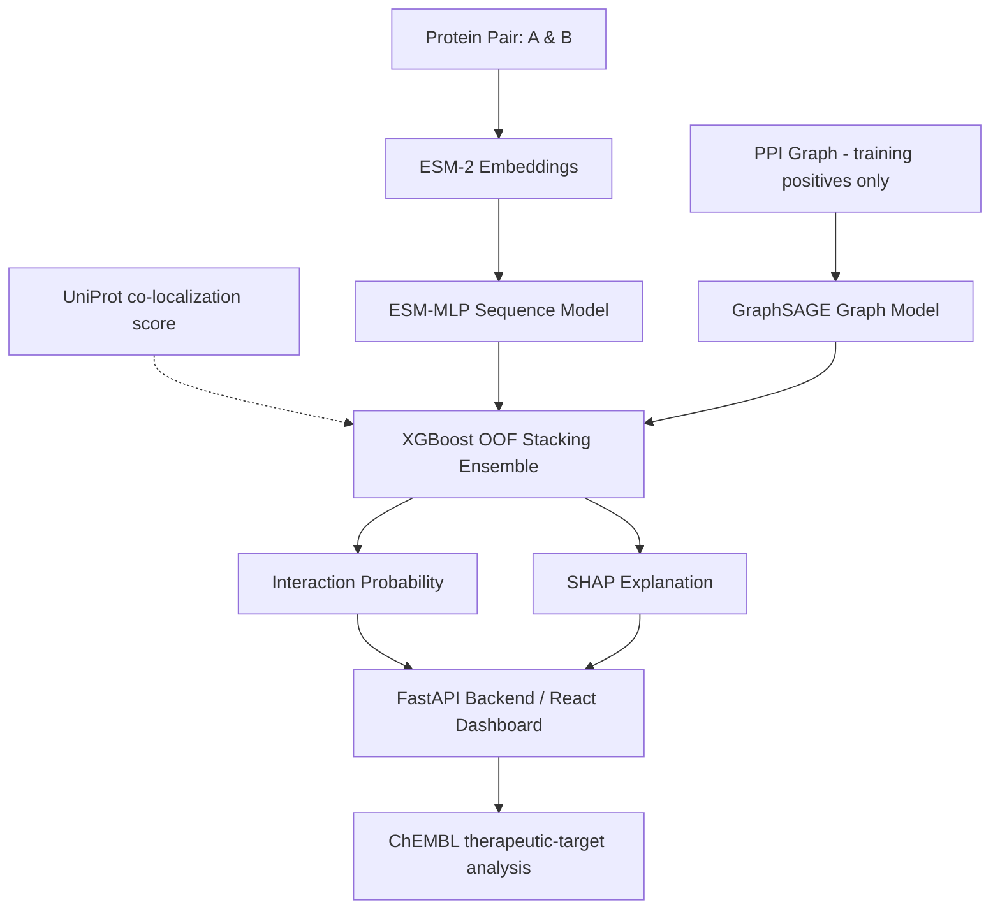

<p align="center">
  
</p>

# TransGraph-PPI
### Hybrid Deep Learning Framework for Protein–Protein Interaction Prediction


**TransGraph-PPI** is a research-oriented multimodal machine learning framework designed for **Protein–Protein Interaction (PPI) prediction**. It integrates deep protein sequence embeddings (ESM-2), graph topological representations (GraphSAGE), an Out-Of-Fold XGBoost stacking meta-ensemble, SHAP explainability, and ChEMBL-based downstream therapeutic-target analysis.

---

## 📌 Overview

Protein–Protein Interactions govern fundamental cellular processes. TransGraph-PPI brings together sequence semantics, biological network topology, domain co-localization context, and explainable AI into a unified web application and prediction pipeline.

### Core Modules

| Component | Architecture / Method | Role |
| :--- | :--- | :--- |
| **Sequence Model** | ESM-2 (`esm2_t12_35M_UR50D`, 35M parameters, 480 dims) + MLP | Deep protein sequence feature extraction & binary interaction scoring |
| **Graph Model** | GraphSAGE (`SAGEConv`) over the training PPI graph | Neighborhood aggregation for link prediction. It has no attention mechanism; the original proposal specified a GAT, but the implemented and evaluated model is GraphSAGE |
| **Biological Context** | UniProt subcellular localization (cache-only score) | One of the 8 ensemble input features; the trained XGBoost model never splits on it, so it has no measurable effect on the reported metrics |
| **Ensemble Meta-Learner** | XGBoost (OOF Stacking) | Stacks the two base-model probabilities plus derived confidence/disagreement features (7 meta-features: `p_seq`, `p_graph`, `conf_seq`, `conf_graph`, `diff`, `max_conf`, `consensus`; `p_graph` is the Platt-calibrated GraphSAGE probability) |
| **Explainability (XAI)** | SHAP (SHapley Additive exPlanations) | Feature attribution on the ensemble's 7 input features (`p_seq`, `p_graph`, `conf_seq`, `conf_graph`, `diff`, `max_conf`, `consensus`) |
| **Downstream Analysis** | Degree / betweenness / PageRank centrality + ChEMBL target lookup | Therapeutic-target prioritization (a heuristic score, not a validated ranking) |

---

## 📐 System Architecture



---

## 📊 Final Test Performance

Metrics come from a single evaluation of the held-out **test set (20,172 pairs)**, produced by `python src/analysis/compare_models.py`
and stored in `assets/evaluation/final_test_metrics.json` (also served by `GET /evaluation/final` and shown on the Benchmark page).
Decision thresholds were selected on the validation set (F1-maximizing sweep over 0.10-0.89); the test set was not used for any selection.
All 20,172 test rows were evaluated (none filtered).

| Model | Val-selected threshold | Accuracy | Precision | Recall | F1 | ROC-AUC | PR-AUC |
| :--- | :---: | :---: | :---: | :---: | :---: | :---: | :---: |
| **Random Forest baseline** | 0.4700 | 0.8234 | 0.8114 | 0.8428 | 0.8268 | 0.9065 | 0.9124 |
| **ESM-MLP (sequence only)** | 0.4900 | 0.8711 | 0.8600 | 0.8865 | 0.8730 | 0.9438 | 0.9474 |
| **GraphSAGE (graph only, calibrated)** | 0.5900 | 0.9042 | 0.9201 | 0.8852 | 0.9023 | 0.9487 | 0.9616 |
| **XGBoost Ensemble (OOF stacking)** | **0.5000** | **0.9213** | **0.9359** | **0.9046** | **0.9200** | **0.9708** | **0.9759** |

> **Status: Verified Clean Benchmark.** Evaluated end-to-end on clean, contamination-free negatives (0 STRING pairs at any score) and strictly disjoint 5-fold OOF training graphs with zero edge leakage. All predictions use the 7-feature meta-learner with Platt-calibrated GraphSAGE probabilities.

Notes:
- 5-fold pair-level stratified OOF predictions are used to train the XGBoost meta-learner (`src/training/train_ensemble.py`).
- The ensemble achieves the highest accuracy (**92.13%**), precision (**93.59%**), recall (**90.46%**), F1 (**0.9200**), ROC-AUC (**0.9708**) and PR-AUC (**0.9759**) among all evaluated configurations on this held-out test split.
- The evaluation is **transductive pair prediction** (see below).

---

## 📁 Dataset & Evaluation Protocol

| Property | Full Dataset | Train | Validation | Test |
| :--- | :---: | :---: | :---: | :---: |
| **Protein pairs** | 201,712 | 161,369 | 20,171 | 20,172 |
| **Positive / negative** | 100,856 / 100,856 | 80,685 / 80,684 | 10,085 / 10,086 | 10,086 / 10,086 |
| **Class balance** | 1:1 | 1:1 | 1:1 | 1:1 |

- **Unique human proteins**: 12,323.
- **Split**: stratified 80/10/10 at the *pair* level (`random_state=42`, `src/data/preprocess_data.py`). The splits are **pair-disjoint but not node-disjoint**: every protein in the test set also occurs in the training set. Pair overlap between splits is zero (`scripts/verify_splits.py`).
- **Graph**: built from the 80,685 positive training pairs only; no validation or test positive appears among its edges. Node features are the 480-d ESM-2 embedding plus degree centrality, clustering coefficient and PageRank.
- **Positives**: STRING v12 human interactions filtered by `combined_score` (script default `--min_score 900`).
- **Negatives**: a mix of random pairs (subject to a UniProt co-localization constraint) and common-neighbor "hard" negatives (`--hard_ratio`, default 0.5). A candidate is rejected if it appears in STRING at **any** confidence (score > 0), and `preprocess_data.py` raises if any final negative is a STRING pair. `--seed` (default 42) makes the split reproducible.
- **Thresholds**: chosen on the validation set only.

---

## ⚙️ Model Notes

- Sequence embeddings use ESM-2 `esm2_t12_35M_UR50D` (35M parameters, 480 dimensions); larger ESM-2 variants are untested.
- `config.yaml` holds device and training defaults. No latency or hardware benchmarks are reported here.

---

## 🚀 Getting Started

### 1. Environment Setup

```bash
# Clone the repository
git clone https://github.com/yourusername/TransGraph-PPI.git
cd TransGraph-PPI

# Create and activate Python environment
python -m venv venv
# On Windows:
venv\Scripts\activate
# On Linux/macOS:
# source venv/bin/activate

# Install requirements
pip install -r requirements.txt
```

### 2. Frontend Setup

```bash
cd app/frontend
npm install
cd ../..
```

---

## 💻 Running the Application

### Start FastAPI Backend
```bash
cd app/backend
uvicorn main:app --reload --port 8000
```
*API docs available at `http://localhost:8000/docs`.*

### Start React Web Interface
```bash
cd app/frontend
npm run dev
```
*Web dashboard available at `http://localhost:5173`.*

---

## 🛠️ Data & Training Pipelines

Run the steps in this order (each step consumes the previous step's output). GPU is used automatically when available
(e.g. a Colab T4) and everything falls back to CPU otherwise. Training scripts accept `--checkpoint_dir` (mount Google
Drive there on Colab) and `--ckpt_every N`; interrupted runs resume from their last checkpoint / finished OOF fold.

```bash
# 1. Data collection & preprocessing (writes data/processed/{train,val,test}.csv; verifies no negative is a STRING pair)
python src/data/collect_ppi.py
python src/data/preprocess_data.py --seed 42
python scripts/verify_splits.py

# 2. ESM-2 embeddings (very large; GPU strongly advised)
python src/data/feature_extraction.py

# 3. Graph construction (training positives only -> ppi_graph.pt + node mapping)
python src/data/graph_construction.py

# 4. Base models (each early-stops on val.csv)
python src/training/train_sequence_model.py --embedding_path data/processed/embeddings.pt
python src/training/train_graph_model.py --graph_path data/processed/ppi_graph.pt   # also fits + saves the Platt calibrator on val.csv
python src/training/train_random_forest.py                                          # RF baseline

# 5. Stacking ensemble (5-fold OOF with per-fold graph features, same training budget as step 4)
python src/training/train_ensemble.py

# 6. Final held-out test evaluation + SHAP (writes assets/evaluation/final_test_metrics.json)
python src/analysis/compare_models.py

# Optional: dataset / calibration audit
python scripts/audit_measurements.py --out assets/evaluation/audit/audit_current.json
```

`scripts/colab_pipeline.sh` runs steps 1-6 in order with Drive-backed checkpoints and finishes with
`pip freeze > requirements-lock.txt`; that lock file must be generated in the Colab runtime that produced the results.

Archived, unused-in-results experiments (heterogeneous graph GNN, meta-learner search scripts) live in `experiments/archive/`.

### Running Test Suite
```bash
pytest tests/
```
*(`tests/test_all_endpoints.py` and `test_explainers_integration` need trained 7-feature models and fail until the pipeline is re-run)*

---

## 📂 Project Structure

```
TransGraph-PPI
├── app
│   ├── backend               # FastAPI REST API (inference, SHAP, network endpoints)
│   └── frontend              # React + Vite web dashboard
├── data
│   ├── processed             # Dataset CSVs, embeddings, graph representations
│   └── raw                   # Raw database downloads
├── docs                      # Validation records & diagnostic reports
├── models                    # Trained PyTorch & XGBoost model checkpoints
├── src
│   ├── data                  # Collection, preprocessing, ESM-2 extraction scripts
│   ├── models                # MLP and GraphSAGE neural network definitions
│   ├── training              # Sequence, graph (GraphSAGE), and ensemble training scripts
│   └── evaluation            # Metric calculation and validation scripts
├── tests                     # Unit & end-to-end integration safety tests
└── README.md
```

---

## ⚠️ Explicit Limitations

1. **Transductive evaluation**: the split is pair-disjoint, not node-disjoint, so the main results table does not measure generalization to unseen proteins. A simulated semi-cold-start check (`scripts/cold_start_eval.py`, `assets/evaluation/cold_start_eval.json`) removes 400 proteins from the trained graph, forces them through the exact production `insert_novel_node_knn` reconstruction path in `/predict`, and scores against real test.csv labels: accuracy 0.833 / ROC-AUC 0.937 (vs. 0.910 / 0.960 for the same pairs when the protein's real node is present), stable across a second seed/held-out set (0.839 / 0.958 vs. 0.927 / 0.980). This is real evidence that the cold-start path works and degrades gracefully rather than failing, but is **not** a from-scratch protein-disjoint retrain — the base models' weights were still originally fit with these proteins' data available, so this should be read as "the inference-time reconstruction mechanism is functional," not "the model generalizes to truly unseen proteins." The Cross-Species page remains exploratory and unevaluated.
2. **Single split, single run**: the main results come from one seed/split. A 2,000-resample bootstrap on the test set gives 95% CIs for the ensemble: accuracy [0.9176, 0.9251], ROC-AUC [0.9687, 0.9729], F1 [0.9162, 0.9239] (`assets/evaluation/bootstrap_ci.json`) — no independent multi-seed retraining has been done.
3. **Biological feature**: the co-localization score is display-only and is not an ensemble input (the meta-vector has 7 features).
3a. **Degree-bias baseline**: a logistic regression on the log positive-degree of the two proteins alone reaches accuracy 0.7063 / ROC-AUC 0.7838 on the test set (`assets/evaluation/audit/audit_after_data.json`), so a substantial part of the signal is node-degree bias that the transductive split does not remove.
3b. **Calibration**: on val.csv the Platt calibrator lowered GraphSAGE ECE from 0.15344 to 0.05018 and Brier from 0.11871 to 0.07455 (`assets/evaluation/graph_calibration.json`; the calibrator is fit and scored on the same val set, the cross-fitted ECE is 0.05009).
4. **Synthetic negatives**: negatives are sampled, not experimentally validated, and may include unannotated true interactions.
5. **No external benchmark**: no evaluation on other datasets (e.g. SHS27k, SHS148k, HuRI, BioGRID) has been run, so no comparison with published methods is made.
6. **Embedding scale**: only the 35M-parameter ESM-2 model was used.
7. **Therapeutic targets**: the TTPS score (0.40 degree + 0.35 betweenness + 0.25 ChEMBL indicator) is a heuristic with user-chosen weights, not a validated ranking.

---

## 🔮 Future Research Directions

- **From-scratch protein-disjoint retrain**: a genuinely held-out-protein split and retrain (the simulated cold-start check above reuses the existing trained weights, so it is a weaker check than this) and external datasets (such as HuRI or BioGRID) to measure generalization to unseen proteins.
- **Model scaling**: higher-capacity ESM-2 variants for the sequence model.

---

## 📜 Citation

If you reference or build upon this research framework in your work:

```bibtex
@misc{transgraph_ppi_2026,
  title={TransGraph-PPI: Research Framework for Multimodal Protein-Protein Interaction Prediction},
  author={Ashwini Shenoy B and Basil S},
  year={2026},
  publisher={GitHub},
  journal={GitHub Repository},
  howpublished={\url{https://github.com/yourusername/TransGraph-PPI}}
}
```

---

## 👥 Authors & Acknowledgments

- **Ashwini Shenoy B**
- **Basil S**

*Major Project — Deep Learning for Bioinformatics*
