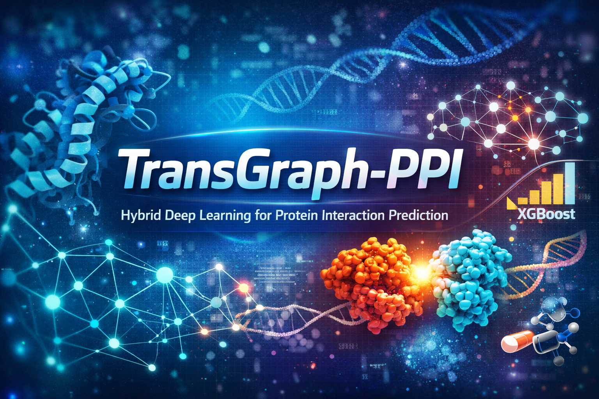
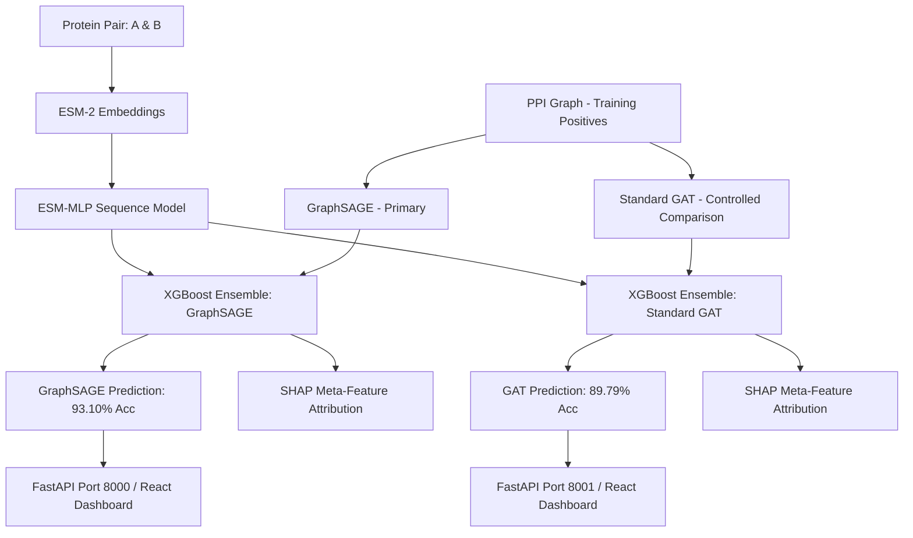

<p align="center">
  
</p>

# TransGraph-PPI
### Hybrid Deep Learning Framework for Protein–Protein Interaction Prediction


**TransGraph-PPI** is a multimodal deep learning framework for **Protein–Protein Interaction (PPI) prediction**. It integrates deep protein sequence embeddings (ESM-2), graph topological representations, an Out-Of-Fold XGBoost stacking meta-ensemble, SHAP explainability, and downstream therapeutic-target analysis.

The project maintains two validated graph architectures under a rigorous controlled comparison:
1. **GraphSAGE** — **Primary Final Model** (`ESM-2 + GraphSAGE + XGBoost + SHAP`), deployed as the production backend on port 8000.
2. **Standard GAT** — **Controlled Experimental Comparison** (`ESM-2 + Standard GAT + XGBoost + SHAP`), matching the original proposal and running on an isolated backend on port 8001.

---

## 📌 Overview

Protein–Protein Interactions govern fundamental cellular processes. TransGraph-PPI brings together sequence semantics, biological network topology, domain co-localization context, and explainable AI into a unified web application and prediction pipeline.

### Core Modules

| Component | Architecture / Method | Role |
| :--- | :--- | :--- |
| **Sequence Model** | ESM-2 (`esm2_t30_150M_UR50D`, 150M parameters, 640 dims) + MLP | Deep protein sequence feature extraction & binary interaction scoring |
| **Graph Model (Primary)** | GraphSAGE (`SAGEConv`) over training PPI graph | Primary graph aggregation architecture for efficient neighborhood representation |
| **Graph Model (Comparison)** | Standard GAT (`GATConv`, 4 heads) over training PPI graph | Controlled experimental comparison based on the original project proposal |
| **Biological Context** | UniProt subcellular localization (cache-only score) | Contextual co-localization signal |
| **Ensemble Meta-Learner** | XGBoost (5-Fold Stratified OOF Stacking) | Stacks sequence and calibrated graph probabilities plus confidence/disagreement meta-features |
| **Explainability (XAI)** | SHAP (TreeExplainer) + GAT attention | SHAP attributes each prediction to the XGBoost meta-features (both models); for the GAT model, the per-layer attention coefficients show which graph neighbours each protein's encoding attended to (Predict page, Evidence tab) |
| **Downstream Analysis** | Centrality + ChEMBL target lookup on the predicted network | Therapeutic-target prioritization on the known interactions plus the interactions the ensemble predicts on held-out pairs (switchable to the known network) |

---

## 📐 System Architecture


```mermaid
graph TD
    A[Protein Pair: A & B] --> B[ESM-2 Embeddings]
    B --> C[ESM-MLP Sequence Model]

    D[PPI Graph - Training Positives] --> E1[GraphSAGE - Primary]
    D --> E2[Standard GAT - Controlled Comparison]

    C --> F1[XGBoost Ensemble: GraphSAGE]
    E1 --> F1
    F1 --> G1[GraphSAGE Prediction: 93.10% Acc]
    F1 --> H1[SHAP Meta-Feature Attribution]

    C --> F2[XGBoost Ensemble: Standard GAT]
    E2 --> F2
    F2 --> G2[GAT Prediction: 89.79% Acc]
    F2 --> H2[SHAP Meta-Feature Attribution]

    G1 --> L[FastAPI Port 8000 / React Dashboard]
    G2 --> L2[FastAPI Port 8001 / React Dashboard]
```

---

## 📊 Final Test Performance

Metrics reflect evaluation on the held-out **test set (20,172 pairs)** with 5-fold stratified OOF training.

### Controlled Graph Architecture Comparison

| Model | Accuracy | Precision | Recall | F1 | ROC-AUC | PR-AUC | Role |
| :--- | :---: | :---: | :---: | :---: | :---: | :---: | :--- |
| **ESM-2 + GAT + XGBoost** | 89.79% | 0.9205 | 0.8710 | 0.8951 | 0.9582 | 0.9627 | *Controlled Experimental Comparison* |
| **ESM-2 + GraphSAGE + XGBoost** | **93.10%** | **0.9448** | **0.9155** | **0.9300** | **0.9753** | **0.9801** | **Primary Final Model** |

### Detailed Benchmark Breakdown

| Model Configuration | Threshold | Accuracy | Precision | Recall | F1 | ROC-AUC | PR-AUC |
| :--- | :---: | :---: | :---: | :---: | :---: | :---: | :---: |
| **Random Forest Baseline** | 0.4800 | 0.8374 | 0.8380 | 0.8365 | 0.8373 | 0.9163 | 0.9222 |
| **GAT Base (Graph Only)** | 0.4700 | 0.7630 | 0.7681 | 0.7538 | 0.7609 | 0.8487 | 0.8665 |
| **ESM-MLP (Sequence Only)** | 0.4500 | 0.8842 | 0.8667 | 0.9082 | 0.8870 | 0.9530 | 0.9569 |
| **GraphSAGE Base (Calibrated)** | 0.6100 | 0.9162 | 0.9355 | 0.8940 | 0.9143 | 0.9562 | 0.9681 |
| **ESM-2 + GAT + XGBoost** | 0.5000 | 0.8979 | 0.9205 | 0.8710 | 0.8951 | 0.9582 | 0.9627 |
| **ESM-2 + GraphSAGE + XGBoost** | **0.4500** | **0.9310** | **0.9448** | **0.9155** | **0.9300** | **0.9753** | **0.9801** |

> **Status: Verified Clean Benchmark.** Evaluated end-to-end on clean, contamination-free negatives (0 STRING pairs at any score) and strictly disjoint 5-fold OOF training graphs with zero edge leakage. All predictions use the 7-feature meta-learner with Platt-calibrated GraphSAGE probabilities.

Notes:
- 5-fold pair-level stratified OOF predictions are used to train the XGBoost meta-learner (`src/training/train_ensemble.py`).
- The ensemble achieves the highest accuracy (**93.10%**), precision (**94.48%**), recall (**91.55%**), F1 (**0.9300**), ROC-AUC (**0.9753**) and PR-AUC (**0.9801**) among all evaluated configurations on this held-out test split.
- The evaluation is **transductive pair prediction** (see below).

---

## 📁 Dataset & Evaluation Protocol

| Property | Full Dataset | Train | Validation | Test |
| :--- | :---: | :---: | :---: | :---: |
| **Protein pairs** | 201,712 | 161,369 | 20,171 | 20,172 |
| **Positive / negative** | 100,856 / 100,856 | 80,685 / 80,684 | 10,085 / 10,086 | 10,086 / 10,086 |
| **Class balance** | 1:1 | 1:1 | 1:1 | 1:1 |

- **Unique human proteins**: 12,323.
- **Split**: stratified 80/10/10 at the *pair* level (`random_state=42`, `src/data/preprocess_data.py`). The splits are **pair-disjoint but not node-disjoint**: every protein in the test set also occurs in the training set. Pair overlap between splits is zero (`scripts/verify_splits.py`).
- **Graph**: built from the 80,685 positive training pairs only; no validation or test positive appears among its edges. Node features are the 640-d ESM-2 embedding plus degree centrality, clustering coefficient and PageRank (643 dimensions total).
- **Positives**: STRING v12 human interactions filtered by `combined_score` (script default `--min_score 900`).
- **Negatives**: a mix of random pairs (subject to a UniProt co-localization constraint) and common-neighbor "hard" negatives (`--hard_ratio`, default 0.5). A candidate is rejected if it appears in STRING at **any** confidence (score > 0), and `preprocess_data.py` raises if any final negative is a STRING pair. `--seed` (default 42) makes the split reproducible.
- **Thresholds**: chosen on the validation set only.

---

## ⚙️ Model Notes

- Sequence embeddings use ESM-2 `esm2_t30_150M_UR50D` (150M parameters, 640 dimensions).
- Training defaults (epochs, early-stopping patience, learning rate, batch size) live in `SEQ_CFG` / `GRAPH_CFG` in `src/training/base_trainers.py`; the training scripts accept `--epochs`, `--lr` (and `--batch_size` for the sequence model) to override them. No latency or hardware benchmarks are reported here.

---

## 🚀 Getting Started

### 1. Environment Setup

```bash
# Clone the repository
git clone https://github.com/yourusername/TransGraph-PPI.git
cd TransGraph-PPI

# Create and activate Python environment
python -m venv venv
# On Windows:
venv\Scripts\activate
# On Linux/macOS:
# source venv/bin/activate

# Install requirements
pip install -r requirements.txt
```

### 2. Frontend Setup

```bash
cd app/frontend
npm install
cd ../..
```

---

## 💻 Running the Application

### 1. Start GraphSAGE Backend (Primary Production Service — Port 8000)
```bash
python -m uvicorn app.backend.main:app --port 8000 --reload
```
*API docs available at `http://localhost:8000/docs`.*

### 2. Start Standard GAT Backend (Controlled Comparison Service — Port 8001, Optional)
```bash
python ESMGAT/backend/main.py
```
*API docs available at `http://localhost:8001/docs`.*
*(If this service is offline, GraphSAGE prediction continues functioning normally).*

### 3. Start React Web Dashboard
```bash
cd app/frontend
npm run dev
```
*Web dashboard available at `http://localhost:5173`.*

---

## 🛠️ Data & Training Pipelines

Run the steps in this order (each step consumes the previous step's output). GPU is used automatically when available
(e.g. a Colab T4) and everything falls back to CPU otherwise. Training scripts accept `--checkpoint_dir` (mount Google
Drive there on Colab) and `--ckpt_every N`; interrupted runs resume from their last checkpoint / finished OOF fold.

```bash
# 1. Data collection & preprocessing (writes data/processed/{train,val,test}.csv; verifies no negative is a STRING pair)
python src/data/collect_ppi.py
python src/data/preprocess_data.py --seed 42
python scripts/verify_splits.py

# 2. ESM-2 embeddings (very large; GPU strongly advised)
python src/data/feature_extraction.py

# 3. Graph construction (training positives only -> ppi_graph.pt + node mapping)
python src/data/graph_construction.py

# 4. Base models (each early-stops on val.csv)
python src/training/train_sequence_model.py --embedding_path data/processed/embeddings.pt
python src/training/train_graph_model.py --graph_path data/processed/ppi_graph.pt   # also fits + saves the Platt calibrator on val.csv
python src/training/train_random_forest.py                                          # RF baseline

# 5. Stacking ensemble (5-fold OOF with per-fold graph features, same training budget as step 4)
python src/training/train_ensemble.py

# 6. Final held-out test evaluation + SHAP (writes assets/evaluation/final_test_metrics.json)
python src/evaluation/compare_models.py

# 7. Predicted interaction network for the target analysis (known train positives + held-out pairs the
#    ensemble predicts as interacting; checks it reproduces the committed test predictions)
python scripts/build_predicted_network.py

# Optional: 95% bootstrap CIs from the committed test predictions
python scripts/evaluation/bootstrap_ci.py

# Optional: dataset / calibration audit
python scripts/evaluation/audit_measurements.py --out assets/evaluation/audit/audit_current.json
```

`scripts/colab_pipeline.sh` runs steps 1-6 in order with Drive-backed checkpoints and finishes with
`pip freeze > requirements-lock.txt`; that lock file must be generated in the Colab runtime that produced the results.

### Running Test Suite
```bash
pytest tests/ -v
```

---

## 📂 Project Structure

```
TransGraph-PPI
├── app
│   ├── backend               # Primary FastAPI REST API (GraphSAGE, SHAP, network endpoints; Port 8000)
│   │   └── routers           # One router per feature area (prediction, network, biology, mutation, ...)
│   └── frontend              # React + Vite web dashboard (src/pages, src/components, src/services/api.js)
├── ESMGAT                    # Standard GAT Controlled Comparison Tree
│   ├── backend               # Isolated GAT FastAPI REST API (Port 8001)
│   ├── checkpoints/oof       # 5-fold GAT OOF predictions (not in git)
│   ├── models                # Standard GAT neural network & ensemble wrappers
│   ├── results               # GAT evaluation metrics, reports, SHAP outputs
│   ├── training              # GAT training, OOF generation, stacking and evaluation scripts
│   └── weights               # Frozen GAT weights (gat_model_best.pth, calibrator, ensemble)
├── assets
│   ├── evaluation            # Final test metrics, bootstrap CIs, benchmark JSONs and plots
│   └── report_figures        # Figures used in the report
├── checkpoints               # Training resume points + 5-fold base-model OOF predictions (not in git)
├── data
│   ├── processed             # Dataset CSVs, embeddings, graph representations (not in git)
│   └── raw                   # Raw database downloads (not in git)
├── docs                      # Setup guide, validation record, benchmarks, paper, proposal
│   └── examples              # Sample batch-prediction input
├── models                    # Frozen GraphSAGE PyTorch & XGBoost production checkpoints (not in git)
├── notebooks                 # Colab training notebooks (main pipeline + GAT comparison)
├── scripts                   # Pipeline runner, split/path verification, target population
│   └── evaluation            # Cold-start, external benchmarks, audit, and plot generation
├── src
│   ├── analysis              # Runtime analysis used by the API (SHAP, mutations, hotspots, network, assistant)
│   ├── data                  # Collection, preprocessing, ESM-2 extraction, sequence/ID/target managers
│   ├── evaluation            # Final held-out test evaluation (compare_models.py) and statistical tests
│   ├── models                # MLP, GraphSAGE and XGBoost ensemble definitions
│   ├── training              # Sequence, graph (GraphSAGE), RF baseline and ensemble training scripts
│   └── utils                 # Paths, ESM config, calibration, seeding, feature helpers
├── tests                     # Unit & end-to-end integration safety tests
└── README.md
```

---

## ⚠️ Explicit Limitations

1. **Transductive evaluation**: the split is pair-disjoint, not node-disjoint, so the main results table does not measure generalization to unseen proteins. A simulated semi-cold-start check (`scripts/evaluation/cold_start_eval.py`, `assets/evaluation/cold_start_eval.json`) removes 400 proteins from the trained graph, forces them through the exact production `insert_novel_node_knn` reconstruction path in `/predict`, and scores against real test.csv labels: accuracy 0.832 / ROC-AUC 0.948 (vs. 0.926 / 0.971 for the same pairs when the protein's real node is present), stable across a second seed/held-out set (0.839 / 0.958 vs. 0.927 / 0.980). This is real evidence that the cold-start path works and degrades gracefully rather than failing, but is **not** a from-scratch protein-disjoint retrain — the base models' weights were still originally fit with these proteins' data available, so this should be read as "the inference-time reconstruction mechanism is functional," not "the model generalizes to truly unseen proteins." The Cross-Species page remains exploratory and unevaluated.
2. **Single split, single run**: the main results come from one seed/split. A 2,000-resample bootstrap on the test set gives 95% CIs for the ensemble: accuracy [0.9274, 0.9346], ROC-AUC [0.9732, 0.9772], F1 [0.9262, 0.9336] (`scripts/evaluation/bootstrap_ci.py`, `assets/evaluation/bootstrap_ci.json`) — no independent multi-seed retraining has been done.
3. **Biological feature**: the co-localization score is display-only and is not an ensemble input (the meta-vector has 7 features).
3a. **Degree-bias baseline**: a logistic regression on the log positive-degree of the two proteins alone reaches accuracy 0.7063 / ROC-AUC 0.7838 on the test set (`assets/evaluation/audit/audit_after_data.json`), so a substantial part of the signal is node-degree bias that the transductive split does not remove.
3b. **Calibration**: on val.csv the Platt calibrator lowered GraphSAGE ECE from 0.14472 to 0.05097 and Brier from 0.10694 to 0.06616 (`assets/evaluation/graph_calibration.json`; the calibrator is fit and scored on the same val set, the cross-fitted ECE is 0.05097).
4. **Synthetic negatives**: negatives are sampled, not experimentally validated, and may include unannotated true interactions.
5. **External benchmarks**: run with the same, unretrained checkpoints via the exact `/predict` inference path (`scripts/evaluation/external_benchmark_shs27k.py`, `scripts/evaluation/external_benchmark_huri.py`), against real labels, not against a curated "easy" slice.
   - **SHS27k** (Chen et al.; 15,248 pairs, 1,690 proteins, 81% byte-identical to training proteins — same underlying database, STRING, just a different curated snapshot, not an independent source): accuracy 0.699, ROC-AUC 0.815, F1 0.605 (`assets/evaluation/external_benchmark_shs27k.json`). A steep drop from the 93.10% in-domain result, consistent with this project's own cited literature that cross-dataset PPI accuracy plateaus well below in-domain numbers.
   - **HuRI / HI-union** (Luck et al. 2020, systematic yeast-two-hybrid screen — a genuinely independent source, not derived from STRING; 700 pairs sampled from the full 64,006-pair set, 684 scored, 728 genes): accuracy 0.519, ROC-AUC 0.585, F1 0.118 (`assets/evaluation/external_benchmark_huri.json`), barely above chance. The confusion matrix shows the model predicts positive on only 4.5% of pairs versus the true 50% positive rate — a strong under-confidence bias on this out-of-distribution data, not random noise. This is the clearest evidence in the whole project that the model does not generalize to a genuinely different interaction-detection modality, and should be stated plainly as a limitation, not minimized.
   - Neither benchmark involved any retraining; both reuse the checkpoints behind the main 93.10% result and the same cold-start reconstruction path as `scripts/evaluation/cold_start_eval.py` for proteins absent from the training graph.
6. **Embedding scale**: only one protein language model size was evaluated in the final system (ESM-2 150M, `esm2_t30_150M_UR50D`, 640-d); larger ESM-2 variants (650M, 3B) were not tried.
7. **Therapeutic targets**: the TTPS score (0.40 degree + 0.35 betweenness + 0.25 ChEMBL indicator) is a heuristic with user-chosen weights, not a validated ranking. The predicted network (`scripts/build_predicted_network.py`, `assets/evaluation/predicted_network_summary.json`) adds 19,596 ensemble-predicted interactions from the held-out val/test pairs to the 80,685 known ones; 18,543 of them are STRING interactions and 1,053 are not (candidate new interactions or false positives, which the model cannot distinguish). Only held-out pairs were scored, so it does not search the full space of unseen protein pairs.

---

## 🔮 Future Research Directions

- **From-scratch protein-disjoint retrain**: a genuinely held-out-protein split and retrain (the simulated cold-start check above and the external benchmarks both reuse the existing trained weights, so neither is a from-scratch inductive test) to properly measure generalization to unseen proteins; the HuRI result above suggests this gap is real and currently large.
- **Model scaling**: higher-capacity ESM-2 variants for the sequence model.

---

## 📜 Citation

If you reference or build upon this research framework in your work:

```bibtex
@misc{transgraph_ppi_2026,
  title={TransGraph-PPI: Research Framework for Multimodal Protein-Protein Interaction Prediction},
  author={Ashwini Shenoy B and Basil S},
  year={2026},
  publisher={GitHub},
  journal={GitHub Repository},
  howpublished={\url{https://github.com/yourusername/TransGraph-PPI}}
}
```

---

## 👥 Authors & Acknowledgments

- **Ashwini Shenoy B**
- **Basil S**

*Major Project — Deep Learning for Bioinformatics*
